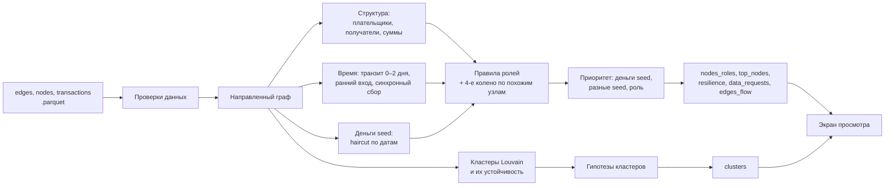

# Аналитика «Граф денег»

Один локальный запуск превращает три Parquet из `docs/data/` в выгрузки в `analysis/out/`: роль и приоритет каждого из 2 248 клиентов, кластеры с гипотезами и топ-лист проверки.

**Главная идея.** Скрипт оценивает, сколько **денег seed** дошло до каждого клиента (метод haircut с учётом дат). Первыми в очереди стоят узлы, где сходятся эти деньги, а не самые крупные по обороту. Все выводы — гипотезы для проверки. Это не утверждения о виновности, принадлежности к группе или реальном управлении счётом.

## Запуск

Из корня репозитория:

```bash
python3 -m venv analysis/.venv
analysis/.venv/bin/python -m pip install -r analysis/requirements.txt
analysis/.venv/bin/python analysis/run.py
```

Или одной командой через [uv](https://docs.astral.sh/uv/). Он сам скачает подходящий Python:

```bash
uv run --no-project --with-requirements analysis/requirements.txt python analysis/run.py
```

Тесты — 26 проверок: правила ролей, деньги seed, контракт выгрузок, устойчивость к порядку строк:

```bash
analysis/.venv/bin/python -m unittest discover -s analysis/tests -v
```

- **Python 3.9–3.13.** Проверено на 3.9.6 (pandas 2.3.3, NumPy 2.0.2, PyArrow 21.0.0) и на 3.12/3.13 (pandas 2.3.3, NumPy 2.5.3, PyArrow 25.0.1). NetworkX зафиксирован на версии 3.2.1. На всех версиях выгрузки совпадают побайтно.
- **Время.** Полный расчёт с проверкой CSV занимает около 4 с (лимит — 300 с). Первый запуск после установки дольше, около 20 с: Python компилирует пакеты.
- **Параметры:** `--data PATH`, `--out PATH`, `--top 30` (минимум 20). Скрипт не пишет в `docs/`. Сеть, LLM и внешние данные не используются.
- **Контракт входа:** июль 2026, порог 5 000 KZT, глубина 4. Для другого периода измените `PERIOD_START`, `PERIOD_END` и `EARLY_END` в начале `run.py`. Все пороги собраны там же.

## Схема решения



## Почему деньги seed, а не оборот

Обход собран от seed по исходящим переводам. Крупный клиент на 2-м колене приносит в граф всех своих получателей, хотя почти все его деньги пришли не из сети. Пример: `100000000331309100` получил из сети 985 тыс. ₸, а отправил 23,0 млн ₸ 99 получателям. Деньгами из сети можно объяснить не больше 4% этого выхода. Рейтинг по обороту ставит такой узел наверх. Модель денег seed показывает, что до него дошло всего ≈47 тыс. ₸ денег seed.

Что показывает модель на приложенных данных:

- Собственных денег seed в выгрузке **51,3 млн ₸**. Seed отправили 55,3 млн ₸, из них 4,0 млн ₸ — пересылка денег других seed.
- Где эти деньги остались: у seed 8%, на 1-м колене **78%**, на 2-м 12%, на 3-м 1,5%, на 4-м **0,08%** (42 тыс. ₸ из 56,7 млн ₸ общего входа 4-го колена).
- Половина денег seed осела у **59 узлов**, 80% — у 189.
- Деньги двух и более разных seed сходятся у **74 узлов**. Это главный структурный сигнал: такое редко бывает случайно.

Вывод: ключевые узлы находятся в 1–2 шагах от seed. «Взрыв» графа на 2–4 колене — в основном чужие деньги крупных плательщиков.

## Деньги seed: метод haircut по датам

Правила модели:

1. Счёт клиента — «котёл» из наблюдаемых поступлений.
2. Перевод уносит из котла долю денег каждого seed, равную их доле в котле (haircut, пропорционально).
3. Переводы обрабатываются по датам: деньги не могут уйти раньше, чем пришли. Внутри дня порядок неизвестен, поэтому поступления дня доступны переводам того же дня. Цепочки одного дня считаются итерацией до сходимости.
4. Если перевод больше котла, недостающая часть — **невидимые деньги**. У обычного клиента они чистые; доля выхода, оплаченная ими, — `external_share`. У seed это его собственные деньги seed.
5. Каждый seed помечается отдельно. Поэтому видно, **от скольких разных seed** пришли деньги (`seed_sources`, считается вклад от 5 000 ₸).

Инвариант «сколько денег seed выпущено, столько и осело» проверяется при каждом запуске.

Haircut — модель смешивания денег, а не трассировка конкретных купюр. Допуск однодневных цепочек даёт верхнюю оценку скорости передачи. Модель сознательно не добавляет невидимые деньги сверх необходимого. Поэтому деньги seed уходят дальше как можно раньше.

## Признаки узла

Обозначения: `I/O` — наблюдаемый вход/выход в KZT, `di/do` — число разных плательщиков/получателей, `ti/to` — число входящих/исходящих переводов.

| Признак | Смысл |
|---|---|
| `r = pass_through` | `O/I`. Считается только для не-seed с depth<4 и I>0, иначе пусто. Это наблюдаемое отношение, а не баланс |
| `m = fast_share` | Доля входа, которая FIFO-сопоставляется с выходом в тот же день или через 1–2 дня. Один KZT не используется дважды |
| `e = early_in_share` | Доля входа, полученная до 24.07 включительно. После этой даты выход мог не попасть в выгрузку |
| `max_payers_day`, `sync_days` | Максимум разных плательщиков за день; число дней с 3+ плательщиками (синхронный сбор) |
| `split_days` | Сколько раз узел отправил одному получателю 3+ перевода за день (дробление) |
| `return_flows` | Число направленных циклов длиной 2–3 через узел (возвратные потоки) |
| `stable_routes` | Число пар (A, C), где цепочка A → узел → C повторилась 2+ раза с интервалом 0–2 дня |
| `seed_in_kzt`, `seed_out_kzt`, `seed_kept_kzt` | Деньги seed: получено, отправлено, осталось к 31.07. Для seed выход включает его собственные деньги |
| `seed_sources`, `seed_forwarded_share` | От скольких seed пришло от 5 000 ₸; какая доля полученных денег seed ушла дальше |
| `external_share` | Доля выхода, не покрытая наблюдаемым входом на момент перевода (только не-seed) |

## Правила ролей

Правила проверяются **сверху вниз**. Первое выполненное правило — основная роль. Следующее выполненное — `secondary_role`. `role_score` — сила признаков основной роли по формуле ниже. Это эвристика, а не вероятность: разметки для калибровки нет. Обозначения: `c(x)=min(max(x,0),1)`, `k = seed_sources`.

| № | Роль | Минимальное условие | role_score |
|---|---|---|---|
| 1 | `coordinator` | не 4-е колено; `di≥2`, `do≥3`, `k≥2` | `0.55 + 0.15c((k−2)/3) + 0.10c(di/10) + 0.10c(do/20)` |
| 2 | `consolidator` | `di≥3`, `do≤di/2` | `0.35 + 0.20c((di−3)/7) + 0.10c(ti/20) + 0.10[max_payers_day≥3] + 0.15c((k−1)/2)` |
| 3 | `distributor` | не 4-е колено; `do≥5` | `0.30 + 0.25c((do−5)/45) + 0.10c(to/50) + 0.10[O≥1 млн]` |
| 4 | `transit` | не seed, depth≤3, `0.8≤r≤1.2` | `0.35 + 0.25m + 0.10c(1−abs(r−1)/0.2) + 0.10[ti≥2 и to≥2] + 0.10[min(I,O)≥100 тыс.]` |
| 5 | `terminal` | не seed, depth≤3, `r≤0.1`, `I≥100 тыс.` или `ti≥3` | `0.30 + 0.20c((ti−1)/4) + 0.15e + 0.10[I≥100 тыс.]` |
| 5 | `terminal` на 4-м колене | ≥75% похожих узлов оставили деньги, похожих ≥100 | `0.20 + 0.15c((p−0.75)/0.25)` |
| 6 | `peripheral` | ничего не выполнено | 0.50 — наблюдение полное; 0.30 — seed; 0.20 — 4-е колено; 0.10 — нет рёбер |

На 4-м колене возможны только роли по входу: `consolidator` и `terminal` по похожим узлам. Их поддержка ограничена значением **0.35**. У seed нет ролей `transit` и `terminal`: их вход неполон, и баланс неизвестен.

Почему такой порядок:

- `coordinator` — самая специфичная гипотеза: деньги нескольких seed сходятся в узле и расходятся дальше. Сам «организатор» в данных не виден, поэтому это только кандидат.
- `consolidator` стоит раньше `transit` и `terminal`: сбор от многих — главный сигнал. Воронка «5 плательщиков → 1 получатель, всё отдал» — это `consolidator` + `transit` вторая. Узел «3 плательщика, всё оставил» — `consolidator` + `terminal` вторая.
- `distributor` стоит раньше `transit`: веер, который пропускает деньги, остаётся веером.
- Слабый признак даёт ту же роль с низким score, а не «периферию». Например, разовый транзит 20 тыс. ₸ → `transit` 0.45.

Смысл порогов: 3 плательщика — «несколько»; 5 получателей — минимальный веер; ±20% — сопоставимость входа и выхода; `r≤0.1` — оставил не меньше 90%; 100 тыс. ₸ — существенная сумма; 24.07 — неделя до конца периода. Пороги выбраны по смыслу до расчёта. Они не подбирались под известные gid и не обучались на разметке.

`patterns` — наблюдаемые паттерны через `;`: `seed`, `isolated`, `boundary`, `external_funding` (≥50% выхода не из сети при O≥100 тыс.), `fast_transit` (m≥0.5), `sync_inflow`, `split`, `return_flow`, `stable_route`, `late_inflow` (e<0.8). Паттерн — повод посмотреть на узел, а не признак нарушения.

## 4-е колено: сравнение с похожими узлами

У 444 узлов 4-го колена выход не виден: там закончился обход. Наивное правило «нет выхода ⇒ конечный получатель» дало бы 444 ложных стока.

Метод. У узлов 1–3 колена выход известен. Разбиваем их на группы по профилю входа, который виден и на 4-м колене:

- в сколько разных дней пришли деньги: 1, 2, 3+;
- пришло ли ≥50% суммы от отправителя-«веера» (10+ получателей).

Для каждой группы считаем долю узлов, которые оставили ≥90% полученного (`r≤0.1`):

| Группа (1–3 колено) | Узлов | Оставили деньги | Узлов 4-го колена |
|---|---:|---:|---:|
| 1 день, от «веера» | 839 | **81%** | 96 |
| 1 день, не от «веера» | 376 | 64% | 255 |
| 2 дня, от «веера» | 137 | 58% | 4 |
| 2 дня, не от «веера» | 89 | 45% | 50 |
| 3+ дней, от «веера» | 142 | 42% | 3 |
| 3+ дней, не от «веера» | 140 | 32% | 36 |

Если в группе ≥75% узлов оставили деньги, а похожих узлов ≥100, выдвигаем гипотезу `terminal` с поддержкой ≤0.35. Иначе узел остаётся `peripheral`, а в evidence пишется доля по группе. Итог: `terminal` 95, `consolidator` 3 (3 плательщика), `peripheral` 346.

**Проверка.** Доли, посчитанные по 1–2 колену, применили к 3-му колену, где выход известен. Правило выбрало 459 из 789 узлов. Конечными оказались 76% выбранных при базовой доле 68%. Сигнал слабый, но проверенный, поэтому уверенность ограничена. При разработке сравнили таблицу с логистической регрессией по 7 признакам входа на той же проверке. Регрессия дала AUC 0.64, таблица — 0.62. Выигрыш мал, поэтому оставили таблицу: её можно объяснить без ML.

Для приоритета граница почти не важна: до 4-го колена дошло 42 тыс. ₸ денег seed.

## Приоритет проверки

```text
M = c(log10(seed_in_kzt / 5 000) / 3)   5 тыс. ₸ → 0; 50 тыс. → 0.33; 500 тыс. → 0.67; 5 млн → 1
K = c((seed_sources − 1) / 3)            1 seed → 0; 2 → 0.33; 3 → 0.67; 4+ → 1
R = W(роль) × role_score
priority_score = round(0.5·M + 0.2·K + 0.3·R, 9)
```

| Роль | W |
|---|---:|
| coordinator | 1.0 |
| consolidator | 0.9 |
| transit | 0.7 |
| terminal | 0.7 |
| distributor | 0.6 |
| peripheral | 0.0 |

- 50% — сколько денег по делу дошло до узла.
- 20% — сходятся ли деньги разных seed (структура, а не случайность).
- 30% — сила роли. Сбор и координация весят больше, веер — меньше: крупный веер обычно платит чужими деньгами.
- Оборот и число контрагентов в формулу **не входят**. Иначе наверх поднимаются хабы с внешними деньгами. Их размер виден в evidence и `external_share`.
- Seed не получает бонуса. Его собственные деньги не считаются полученными, поэтому seed поднимается, только если собирает деньги других seed.

Сортировка: `priority_score` по убыванию, при равенстве — `gid` по возрастанию. Слагаемые хранятся в колонках `money_score`, `sources_score` и `role_part`, поэтому любую позицию можно пересчитать из CSV.

## Кластеры

- **Louvain** на неориентированной проекции: вес ребра = сумма KZT в обе стороны. Параметры: `seed=42`, `resolution=1`. Направление теряется только здесь. Изолированные узлы — отдельные кластеры с номером после больших.
- **Почему вес `sum_kzt`.** При разработке сравнили 4 варианта весов по 10 random seed: `sum_kzt`, `log(sum_kzt)`, `n_tx` и без весов. `sum_kzt` дал самые устойчивые сообщества (ARI 0.91 против 0.68–0.71) и самую высокую модулярность (0.86).
- **`stability`** — средний лучший Jaccard кластера с сообществами при 20 других random seed. Среди 69 кластеров с рёбрами у 60 устойчивость ≥0.8, минимум 0.37. Кластер с низкой устойчивостью — повод не опираться на его границы.
- **Гипотеза** строится по деньгам seed внутри кластера:
  1. нет переводов → назначение неизвестно;
  2. осело ≥100 тыс. ₸ денег seed и у одного узла ≥30% → «сбор денег seed в X»;
  3. деньги рассеяны, и есть веер, отправивший ≥100 тыс. ₸ денег seed → «веерная рассылка денег seed»; иначе → «деньги seed рассредоточены»;
  4. ≥50% выхода участников не из наблюдаемой сети → «окружение крупного плательщика»;
  5. есть веер → «веерная рассылка»; иначе — слабые признаки.

  Итог на данных: сбор — 23, веерная рассылка денег seed — 8, окружение крупного плательщика — 33, без переводов — 19, прочее — 5. В тексте есть число seed, профиль ролей и устойчивость. Кластер — гипотеза о связи, а не установленная организация.

## Устойчивость сети (`resilience.csv`)

Сценарий: исходящие переводы топ-N узлов не происходят (счёт заблокирован). Деньги seed пересчитываются заново. Сценариев два:

- `top_new` — только новые счета из топа, без seed. Seed аналитику уже известны. По ТЗ блокировка нижнего уровня как раз не останавливает схему.
- `top` — весь топ, включая seed.

`top_new`:

| Заблокировано | Крупнейшая компонента | Компонент | Денег seed у остальных клиентов | Денег seed у заблокированных |
|---:|---:|---:|---:|---:|
| 0 | 1 877 | 35 | 92% | 0% |
| 5 | 1 860 | 41 | 86% | 5% |
| 10 | 1 846 | 50 | 80% | 10% |
| 20 | 1 819 | 66 | 72% | 18% |
| 30 | 1 800 | 73 | 63% | 24% |

Доли считаются от всех денег seed, поэтому строки можно сравнивать. При N=0 остальные 8% оседают у самих seed. 30 новых счетов из топа держат четверть всех денег seed.

Граф такой топ почти не рвёт: он отобран по деньгам, а не по связности. Проверка при разработке: рейтинг по обороту и числу контрагентов рвёт граф сильнее (крупнейшая компонента 1 348 при N=30), но его 30 новых счетов держат только 4% денег seed. В сценарии `top` поток режется сильнее (55% при N=30), потому что блокируются и сами seed.

## Запросы данных (`data_requests.csv`)

Для узлов с белым пятном — один следующий запрос, в порядке приоритета. На данных 264 строки:

- деньги seed остались на счёте — проверить остаток, межбанк и наличные (104);
- выход не покрыт входом — запросить входящие извне выборки (92);
- поздние поступления — запросить август (35);
- нет переводов — выписка за другой период и каналы (19);
- seed без исходящих — выписка (12);
- граница обхода — исходящие переводы (2).

## Выгрузки

UTF-8, разделитель — запятая, заголовок в первой строке, дробные значения до 9 знаков. `gid` — int64. В Excel или JavaScript импортируйте его как текст: 18 цифр не помещаются в float без потерь.

**`nodes_roles.csv`** — 2 248 строк по `gid`. Первые шесть колонок — схема ТЗ. Дальше идут:

| Колонка | Смысл |
|---|---|
| `secondary_role` | Следующее выполненное правило, пусто — нет |
| `patterns` | Паттерны через `;` |
| `data_gap` | Следующий запрос данных, пусто — нет |
| `depth`, `is_seed`, `in_*`, `out_*` | Исходные метаданные и наблюдаемые степени, суммы, переводы |
| `pass_through`, `truncated_by_depth`, `seed_in_deg` | O/I (пусто при неполном наблюдении), обрыв 4-го колена, число seed-плательщиков |
| `in_days`, `out_days`, `fast_kzt`, `fast_share`, `early_in_share` | Временные признаки |
| `max_payers_day`, `sync_days`, `split_days`, `return_flows`, `stable_routes` | Паттерны сбора, дробления и маршрутов |
| `seed_in_kzt`, `seed_out_kzt`, `seed_origin_kzt`, `seed_kept_kzt`, `seed_sources`, `seed_share_in`, `seed_forwarded_share`, `external_share` | Деньги seed |
| `from_fan_share`, `similar_segment`, `similar_n`, `similar_p_terminal` | Сравнение с похожими узлами (используется на 4-м колене) |
| `money_score`, `sources_score`, `role_weight`, `role_part` | Слагаемые приоритета |

Пустые значения возможны только в дополнительных колонках: `secondary_role`, `patterns`, `data_gap`, `pass_through`, `external_share`.

**`clusters.csv`** — схема ТЗ, плюс `stability`, `seed_kzt_origin` (выпущено seed кластера), `seed_kzt_kept` (осело у участников), `lead_gid` и `lead_role` (первый узел по приоритету).

**`top_nodes.csv`** — 30 строк по приоритету. `why` — evidence, вторая роль, разложение приоритета и пометка «Уже в списке seed». Дополнительно: `secondary_role`, `is_seed`, `depth`, `cluster_id`, `seed_in_kzt`, `seed_sources`, слагаемые приоритета, `patterns`.

**`resilience.csv`** — `scenario`, `removed_top_n`, `removed_gids`, `largest_component`, `n_components`, `seed_kzt_to_others_share`, `seed_kzt_held_share`. **`data_requests.csv`** — `gid`, `request`, `priority_score`, `role`, `seed_in_kzt`, `seed_kept_kzt`, `depth`, `is_seed`. **`edges_flow.csv`** — рёбра `src, dst, sum_kzt, n_tx` с оценкой денег seed на ребре `seed_kzt` и долей `seed_share`. Нужен экрану, чтобы рисовать поток денег seed.

## Как объяснить узел за минуту

Примеры выбраны **после расчёта**: первый узел каждой роли по приоритету, узлы 4-го колена и изолированный seed. В правилах этих gid нет.

| gid | Результат | Почему |
|---|---|---|
| `100000004015047100` | consolidator 0.76 (+terminal), приоритет 0.75, #1 | 9 плательщиков → 1 получатель, отдал 8%. Деньги 4 разных seed ≈599 тыс. ₸, осталось 551 тыс. ₸. M=0.69, K=1, R=0.9×0.76 |
| `100000003684369100` | coordinator 0.80 (+distributor), 0.71, #3 | Seed. Деньги 3 других seed ≈513 тыс. ₸; 24 плательщика → 62 получателя; 98% входа ушло за 0–2 дня. Собственные деньги этого seed в M не входят |
| `100000002957306100` | terminal 0.60, 0.58, #13 | 2 плательщика, выхода нет, всё пришло до 24.07. 398 тыс. ₸ денег 3 seed: один плательщик переслал деньги двух seed |
| `100000004135268100` | transit 0.73, 0.54, #19 | Получил 1,2 млн ₸, отдал 81%; 69% ушло за 0–2 дня; денег seed 1,1 млн ₸ |
| `100000008748408100` | distributor 0.53, 0.41, #79 | 21 получатель, 1,5 млн ₸. Из сети пришло 360 тыс. ₸: 76% выхода оплачено деньгами вне сети |
| `100000000331309100` | distributor, 0.30, #169 | Хаб: 99 получателей, 23,0 млн ₸, но денег seed ≈47 тыс. ₸, 96% выхода не из сети. В рейтинге по обороту был бы в топе |
| `100000000500040100` | terminal 0.23, 4-е колено | 1 перевод от «веера». Из 839 похожих узлов 81% оставили деньги. Выход не виден, поэтому уверенность низкая |
| `100000005767403100` | peripheral 0.20, 4-е колено | Получил 1,1 млн ₸ за 2 дня. У похожих узлов деньги оставили только 45% — вывода нет. Запрос: исходящие переводы |
| `100000000456947100` | peripheral 0.10, приоритет 0 | Изолированный seed: в выгрузке нет переводов. Сохранён в реестре и в отдельном кластере |

## Проверки

Перед записью и после повторного чтения CSV скрипт проверяет:

- схемы и типы;
- полный набор gid, исходную глубину и seed-флаг;
- степени, суммы и переводы против рёбер;
- допустимые роли, `secondary_role` и диапазоны скоров;
- evidence: до 200 символов и обязательно с числами;
- ограничения 4-го колена и seed;
- деньги seed: не больше наблюдаемых сумм и сохранение «выпущено = осело»;
- кластеры: размеры, число seed, внутренний оборот, `top_gids`, устойчивость;
- порядок и согласованность топа, воспроизводимость формулы приоритета.

Любая ошибка завершает запуск с ненулевым кодом.

Тесты дополнительно проверяют:

- каждое правило ролей на границах порогов;
- модель денег seed на малых графах: время, разбавление, невидимые деньги, атрибуцию seed, блокировку;
- FIFO без повторного использования сумм;
- отказ на повреждённых входах;
- идентичность результата при перемешанных строках Parquet;
- монотонность сценария блокировки;
- то, что метод 4-го колена лучше базовой доли.

## Ограничения

- Видны только внутрибанковские переводы от 5 000 ₸ за июль. Межбанк, наличные, дробление ниже порога и август не видны.
- Вход seed и вход извне графа неполны. Видимый баланс не равен остатку на счёте.
- Деньги seed — модель смешивания. Она не доказывает, что конкретные деньги прошли по цепочке. Допуск однодневных цепочек завышает скорость передачи.
- На 4-м колене выход не наблюдается. Метод похожих узлов даёт лишь слабый сигнал (76% против 68%), отсюда потолок 0.35.
- Одна основная роль и одна вторая скрывают более сложные смешанные профили. Рядом с порогами небольшое изменение данных может изменить роль. Без разметки нельзя сообщать accuracy или называть score вероятностью.
- Louvain зависит от весов и resolution. Устойчивость по random seed не доказывает, что сообщества реальны.

## Рост до ~1 млн узлов

Сейчас память — O(N·S) для денег seed (S — число seed) плюс объекты NetworkX. Время — O(дни × итерации × активные узлы × S). На миллионе узлов узкие места такие:

1. **Данные.** Читать Parquet через DuckDB или Polars пакетами, агрегировать по паре и по `(gid, дата)` вне памяти. Деньги хранить целыми тиынами, gid перекодировать в плотные индексы.
2. **Деньги seed.** Матрица N×S на миллионе узлов не влезет в память. Нужны разреженные векторы: у большинства узлов 0–2 seed. Для десятков тысяч seed — top-k seed на узел плюс остаток «прочие». Расчёт по дням векторизуется на CSR-массивах переводов дня. Однодневные цепочки считать итерацией только по активным узлам.
3. **Кластеры.** Заменить NetworkX на igraph или NetworKit (Leiden) и считать по слабосвязным компонентам. Прогоны для устойчивости запускать параллельно.
4. **Маршруты.** Треугольники и циклы длины 2–3 считать разреженным умножением матриц. Повторяющиеся цепочки A→B→C — соединением переводов по B с окном дат в DuckDB. Не перечислять все пути.
5. **Сценарии блокировки** — это полные пересчёты. Их можно запускать параллельно или считать только по компонентам, которых касается блокировка.
6. Параметры и версии фиксировать, после смены движка повторить все проверки. Лимит времени на новом масштабе нужно измерять заново: 4 с не экстраполируются линейно.
